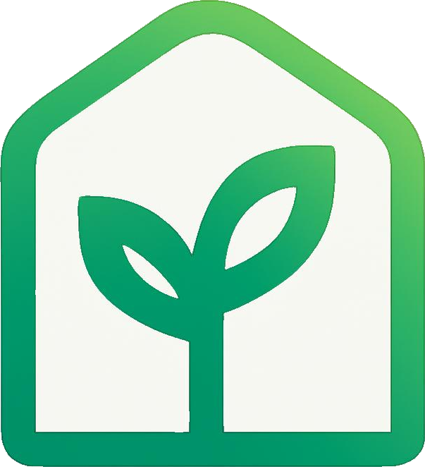
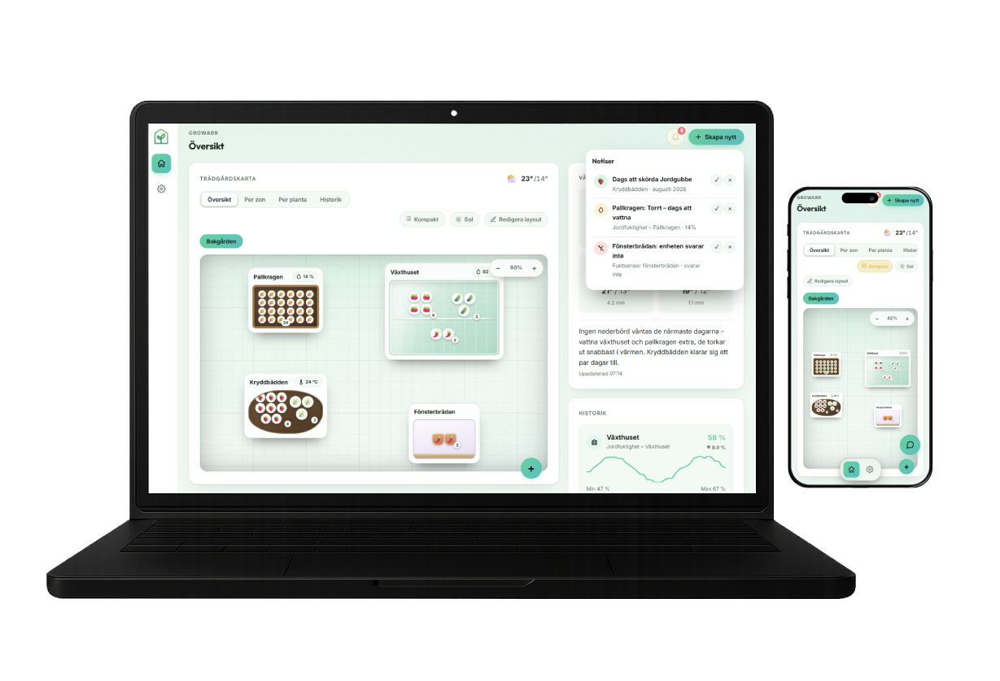

<p align="center">
  
</p>

<h1 align="center">Growarr</h1>

<p align="center">A garden map that knows the weather, waters itself intelligently, and talks to Home Assistant.</p>

<p align="center">
  <a href="https://github.com/mathiasmholm/growarr/actions/workflows/docker-publish.yml"></a>
  <a href="LICENSE"></a>
</p>

Most garden trackers are a spreadsheet with extra steps. Growarr is a real,
drag-and-drop map of your greenhouse, beds and pots that cross-references
the local forecast, learns your garden's own microclimate, and tells you
what actually needs attention today. Self-hosted, and built to plug
straight into a Home Assistant setup you already run.

It's two things in one repo: **the panel** (a single Docker container) and
a free nightly **frost watch** that runs on GitHub Actions and texts your
phone before a cold snap hits.

<p align="center">
  
</p>

> [!NOTE]
> Work in progress. My wife does the actual gardening, and I just built the
> app around what she needs, so it's very much shaped by real day-to-day
> use rather than a finished spec. Feedback, bug reports and feature ideas
> are genuinely welcome.

## Why bother

- **A map, not a form.** Drag greenhouses, beds and pots into place. Plants
  render as icons you can count, not a row in a table.
- **It learns your microclimate.** Link a temperature sensor and it figures
  out over time how much colder your north bed actually runs than the
  regional forecast says.
- **Ask it anything.** Photograph a sick-looking plant and get an answer
  from Claude that's grounded in your actual sensors, not generic advice.
- **It tells you what matters.** A notification center surfaces frost risk,
  dry soil, and harvest windows, optionally prioritized and merged by
  Claude so you get one useful line instead of five.
- **Sun and shadow, worked out for real.** See exactly which beds shade
  each other at any hour, computed from your garden's own coordinates.
- **Feels native on a phone.** Bottom-sheet panels, a floating glass nav
  bar, dark mode. Not a desktop dashboard squeezed onto a small screen.
- **Your data, your box.** One container, one data file, your own Home
  Assistant entities. No accounts, no cloud sync.
- **Notes, history and a watering schedule, each their own page.** Every
  planting's notes in one list with a planting/harvest calendar, one
  searchable chart across every sensor you've linked, and weekday-based
  watering reminders (a stand-in for real irrigation until there's a valve
  to actually drive).

## Getting started

```bash
sudo mkdir -p /opt/docker/growarr && cd /opt/docker/growarr
sudo git clone https://github.com/mathiasmholm/growarr.git .
cp .env.example .env   # fill in HA_TOKEN, GEO_LAT, GEO_LON
sudo docker compose up -d
```

That's a working panel at `:8097`. GitHub Actions rebuilds and republishes
the image on every push; pair it with [Watchtower](https://containrrr.dev/watchtower/)
and updates roll out on their own.

Prefer to update on your own terms instead? Check the
[releases](https://github.com/mathiasmholm/growarr/releases) for a specific
version, e.g. `v1.1.0`, and pin `docker-compose.yml` to it:

```yaml
image: ghcr.io/mathiasmholm/growarr:v1.1.0 # instead of :latest
```

<details>
<summary><strong>Environment variables</strong></summary>

| Variable | Required | What it does |
|---|---|---|
| `PORT` | No (default `8097`) | Port the panel listens on |
| `HA_URL` | For Home Assistant features | Your HA base URL |
| `HA_TOKEN` | For Home Assistant features | A long-lived HA access token |
| `GEO_LAT`, `GEO_LON` | For weather & sun map | Your garden's coordinates |
| `NTFY_TOPIC` | No | Push notifications via [ntfy.sh](https://ntfy.sh) (can also be set later in the UI) |
| `WEBHOOK_URL` | No | Forward notifications to a Home Assistant webhook instead/as well |
| `ANTHROPIC_API_KEY` | No | Unlocks Claude's watering insight, photo chat, and notification prioritization |

Everything except `PORT` also has a matching field in Settings, so you can
skip straight to `docker compose up -d` with a blank `.env` and fill the
rest in through the UI.

</details>

<details>
<summary><strong>Frost watch setup</strong></summary>

The nightly job is separate from the panel and runs on GitHub's own
infrastructure, so it needs its own repo secrets:

1. Add secrets **`GEO_LAT`** and **`GEO_LON`**.
2. Add secret **`NTFY_TOPIC`** and/or **`WEBHOOK_URL`**.
3. Optional: repo variable **`FROST_THRESHOLD`** (°C, default `3`). Margin
   against ground frost, since the forecast is air temperature 2m up.
4. Run it once by hand from the **Actions** tab, or wait for the nightly
   schedule (18:00 Swedish time).

Missing coordinates just skip the run quietly instead of failing.

</details>

<details>
<summary><strong>Reverse proxy</strong></summary>

Point a custom location at the panel, e.g. in Nginx Proxy Manager:

- Location: `/growarr`
- Forward to: your HA host, port `8097`

Then add it to Home Assistant's sidebar as a dashboard pointing at
`https://your-domain/growarr/`. Keep the trailing slash, or the panel's
own API calls end up in the wrong place.

</details>

<details>
<summary><strong>API reference</strong></summary>

| Method | Path | Does |
|---|---|---|
| GET | `/api/weather` | 5-day forecast + coordinates |
| GET / POST | `/api/plantings` | List / add plantings |
| POST | `/api/plantings/update` | Update a planting |
| POST | `/api/plantings/delete` | Delete a planting |
| POST | `/api/zones` | Add a zone (greenhouse, bed, pot…) |
| POST | `/api/zones/update` | Update a zone's position, size, height, soil |
| POST | `/api/zones/delete` | Delete a zone |
| POST | `/api/maps` | Add a garden map (tab) |
| POST | `/api/maps/delete` | Delete a map |
| GET / POST | `/api/widgets` | List / add custom dashboard blocks |
| GET | `/api/devices/status` | Current state of watched HA entities |
| POST | `/api/devices` | Watch a new HA entity |
| POST | `/api/devices/delete` | Stop watching an entity |
| GET | `/api/ha-entities` | Full HA entity list, for autocomplete |
| GET | `/api/camera` | Proxy a snapshot from an HA camera entity |
| GET | `/api/history` | Logged sensor history |
| GET | `/api/watering` | Claude's watering insight |
| POST | `/api/chat` | Chat with Claude, with optional photo |
| GET / POST | `/api/settings` | Read / save settings |
| POST | `/api/notifications` | Mark a notification handled |
| POST | `/api/notifications/ai` | Let Claude prioritize the notification list |
| POST | `/api/schedules` | Add a watering schedule |
| POST | `/api/schedules/delete` | Delete a watering schedule |
| GET | `/api/schedules/suggestions` | Claude's suggested schedules, based on sensor history |

</details>

## No login, by design

The panel has no auth of its own, same model as the rest of a typical
home-lab. Keep it behind your VPN, your LAN, or whatever Zero Trust layer
already fronts your other self-hosted apps.

## What's next

Automatic watering: give it a valve entity once you have one, and the same
sensor data this already collects becomes the trigger.

Ideas and PRs welcome.
